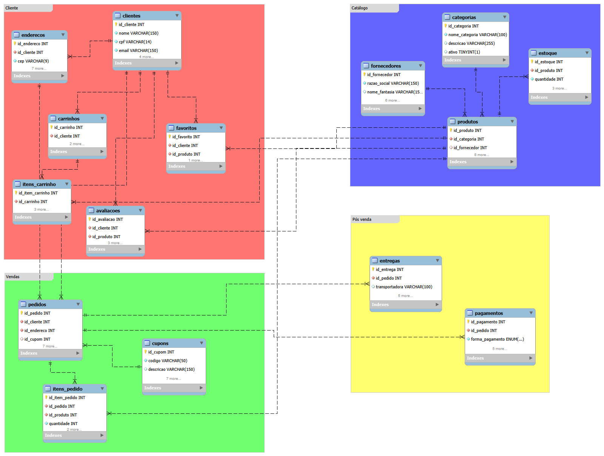

# 🛒 E-commerce Database & Sales Analysis

Projeto prático de banco de dados para um e-commerce, desenvolvido com **MySQL** e **MySQL Workbench**.

O projeto foi criado com o objetivo de praticar conceitos de **modelagem de banco de dados relacional, SQL e análise de dados**, simulando operações comuns de uma plataforma de e-commerce.

> 📌 Todos os dados utilizados neste projeto são fictícios e foram criados exclusivamente para fins educacionais e de portfólio.

---

## 🎯 Objetivo do projeto

Construir um banco de dados relacional capaz de representar diferentes etapas da operação de um e-commerce, incluindo:

- Cadastro de clientes
- Endereços
- Produtos
- Categorias
- Fornecedores
- Controle de estoque
- Carrinho de compras
- Pedidos
- Itens dos pedidos
- Cupons
- Pagamentos
- Entregas
- Produtos favoritos
- Avaliações

Além da construção do banco, o projeto também será utilizado para desenvolver **consultas SQL voltadas à análise de dados e geração de informações relevantes para o negócio**.

---

## 🛠️ Tecnologias utilizadas

- MySQL
- MySQL Workbench
- SQL
- Visual Studio Code
- Git
- GitHub

---

## 🗃️ Modelagem do banco de dados

O banco `ecommerce_db` possui **15 tabelas**, organizadas em quatro áreas funcionais:

### 👤 Cliente

- `clientes`
- `enderecos`
- `carrinhos`
- `itens_carrinho`
- `favoritos`
- `avaliacoes`

### 📦 Catálogo

- `produtos`
- `categorias`
- `fornecedores`
- `estoque`

### 🛒 Vendas

- `pedidos`
- `itens_pedido`
- `cupons`

### 🚚 Pós-venda

- `pagamentos`
- `entregas`

---

## 🔗 Diagrama EER

O diagrama EER foi desenvolvido no **MySQL Workbench** para representar visualmente as tabelas, chaves e relacionamentos existentes no banco.



---

## 📊 Análises com SQL

Além da modelagem do banco, estou desenvolvendo consultas para transformar os dados armazenados em informações úteis para análise.

### 01 — Top 10 produtos mais vendidos

Consulta utilizada para identificar os produtos com maior quantidade de unidades vendidas.

Principais conceitos utilizados:

- `JOIN`
- `SUM()`
- `GROUP BY`
- `ORDER BY`
- `LIMIT`

### Próximas análises

- Produtos com maior faturamento
- Faturamento mensal
- Ticket médio
- Clientes de maior valor
- Vendas por categoria
- Produtos com estoque baixo

---

## 📁 Estrutura do projeto

```text
ecommerce-mysql-analysis/
│
├── README.md
│
├── database/
│   ├── ecommerce_db.sql
│   └── dados_ficticios.sql
│
├── model/
│   └── ecommerce_db_model.mwb
│
├── queries/
│   ├── 01_top_produtos_vendidos.sql
│   ├── 02_top_produtos_faturamento.sql
│   ├── 03_faturamento_mensal.sql
│   ├── 04_ticket_medio.sql
│   ├── 05_clientes_maior_valor.sql
│   ├── 06_vendas_por_categoria.sql
│   └── 07_estoque_baixo.sql
│
└── images/
    └── diagrama_eer.png
